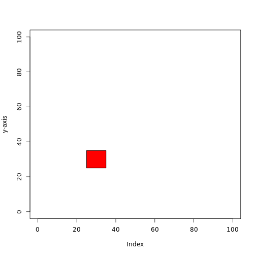

## Drawing Circles and Squares

#DONE


```r
plot(1:2, ylab = "y-axis", type = "n", xlim = c(0, 100), ylim = c(0, 100))

polygon(c(25, 35, 35, 25), c(25, 25, 35, 35), angle = 90, col = "red")
```

 


```r
polygon(c(14, 36, 36, 14), c(44, 44, 71, 71), angle = 90, col = "blue")
```

```
## Error: plot.new has not been called yet
```


```r
polygon(c(15, 35, 35, 15), c(45, 45, 70, 70), angle = 90, col = "green")
```

```
## Error: plot.new has not been called yet
```


```r
polygon(c(65, 80, 85, 72.5, 60), c(50, 50, 70, 80, 70), angle = 75, col = "yellow", 
    border = NA)
```

```
## Error: plot.new has not been called yet
```


```r
drawCircle <- function(x, y, r) {
    angs <- seq(0, 2 * pi, length = 400)
    xpts <- x + r * cos(angs)
    ypts <- y + r * sin(angs)
    polygon(xpts, ypts, col = "light blue", density = 100)
}
drawCircle(50, 50, 25)
```

```
## Error: plot.new has not been called yet
```


```r
drawEllipse <- function(x, y, r) {
    angs <- seq(0, 2 * pi, length = 400)
    xpts <- x + r * cos(angs)
    ypts <- y + 25 * sin(angs)
    polygon(xpts, ypts, col = "purple", density = 80)
}
drawEllipse(22.5, 70, 15)
```

```
## Error: plot.new has not been called yet
```

```


