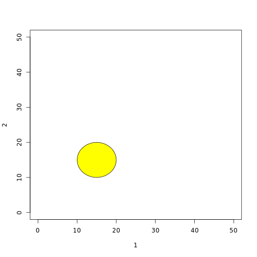

require(plotrix)


```r
countOdds <- function(x) {
    k <- 0
    for (n in x) {
        if (n%%2 == 1) 
            k <- k + 1
    }
    return(k)
}
countOdds(c(3, 5))
```

```
## [1] 2
```


```r
countEvens <- function(x) {
    k <- 0
    for (n in x) {
        if (n%%2 == 0) 
            k <- k + 1
    }
    return(k)
}

countEvens(c(1, 2, 3, 4, 5))
```

```
## [1] 2
```


```r
hypotenuseLength <- function(x, y) {
    h <- sqrt(x^2 + y^2)
    return(h)
}

hypotenuseLength(3, 4)
```

```
## [1] 5
```


```r
lawOfCosines <- function(x, y, z) {
    a <- x^2 + y^2
    b <- -2 * x * y * cos(z)
    h <- sqrt(a - b)
    return(h)
}

lawOfCosines(13, 84, pi/2)
```

```
## [1] 85
```


```r
thetaFromLengths <- function(x, y, z) {
    numerator <- z^2 - x^2 - y^2
    denominator <- -2 * x * y
    theta <- acos(numerator/denominator)
    return(theta)
}
thetaFromLengths(3, 4, 5)
```

```
## [1] 1.571
```


```r
canvas <- function(x) {
    a <- plot(x, type = "n", xlim = c(0, x[1]), ylim = c(0, x[2]))
    return(a)
}
canvas(c(7, 5))
```

 

```
## NULL
```


```r
plot(1, 2, type = "n", xlim = c(0, 50), ylim = c(0, 50))
drawCircle <- function(x, y, r, color) {
    angs <- seq(0, 2 * pi, length = 40)
    xpts <- x + r * cos(angs)
    ypts <- y + r * sin(angs)
    polygon(xpts, ypts, col = color, border = NULL)
    
}
drawCircle(20, 20, 10, col = "red")
```

 


```r
plot(1, 2, type = "n", xlim = c(0, 50), ylim = c(0, 50))
drawCircle <- function(x, y, r, ...) {
    angs <- seq(0, 2 * pi, length = 40)
    xpts <- x + r * cos(angs)
    ypts <- y + r * sin(angs)
    polygon(xpts, ypts, ...)
    
}
drawCircle(15, 15, 5, col = "yellow")
```

 


```r
plot(1, 2, type = "n", xlim = c(0, 50), ylim = c(0, 50))
OverlappingCircles <- function(x, y, r, ...) {
    angs <- seq(0, 2 * pi, length = 40)
    xpts <- x + r * cos(angs)
    ypts <- y + r * sin(angs)
    polygon(xpts, ypts, ...)
}
OverlappingCircles(20, 20, 10, col = "red", density = 100)
OverlappingCircles(25, 25, 10, col = "blue", density = 100)
```

 


```r
plot(1, 2, type = "n", xlim = c(0, 50), ylim = c(0, 50), xlab = "x-axis", ylab = "y-axis")
OlympicLogo <- function(x, y, r, ...) {
    angs <- seq(0, 2 * pi, length = 40)
    xpts <- x + r * cos(angs)
    ypts <- y + r * sin(angs)
    polygon(xpts, ypts, ...)
}
OlympicLogo(15, 25, 6.5, col = "light blue", density = 100)


OlympicLogo2 <- function(x, y, r, ...) {
    angs <- seq(0, 2 * pi, length = 40)
    xpts <- x + r * cos(angs)
    ypts <- y + r * sin(angs)
    polygon(xpts, ypts, ...)
}
OlympicLogo2(20, 20, 6.5, col = "yellow", density = 100)

OlympicLogo3 <- function(x, y, r, ...) {
    angs <- seq(0, 2 * pi, length = 40)
    xpts <- x + r * cos(angs)
    ypts <- y + r * sin(angs)
    polygon(xpts, ypts, ...)
}
OlympicLogo3(25, 25, 6.5, col = "black", density = 100)

OlympicLogo4 <- function(x, y, r, ...) {
    angs <- seq(0, 2 * pi, length = 40)
    xpts <- x + r * cos(angs)
    ypts <- y + r * sin(angs)
    polygon(xpts, ypts, ...)
}
OlympicLogo4(30, 20, 6.5, col = "green", density = 100)

OlympicLogo5 <- function(x, y, r, ...) {
    angs <- seq(0, 2 * pi, length = 40)
    xpts <- x + r * cos(angs)
    ypts <- y + r * sin(angs)
    polygon(xpts, ypts, ...)
}
OlympicLogo5(35, 25, 6.5, col = "red", density = 100)
```

 

