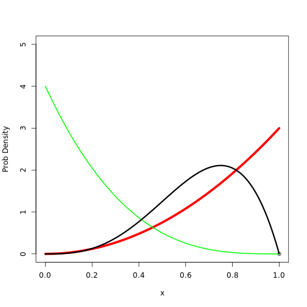

## Draws three beta distribution

```r
shapes <- function(shape1, shape2, ...) {
    x <- seq(0, 1, length = 100)
    plot(0:0, ylim = c(0, 5), xlim = c(0, 1), xlab = "x", ylab = "Prob Density")
    lines(x, dbeta(x, shape1 = shape1, shape2 = shape2), ...)
    lines(x, dbeta(x, shape1 = 1, shape2 = 4), lwd = 2, col = "green")
    lines(x, dbeta(x, shape1 = 4, shape2 = 2), lwd = 3)
}
shapes(3, 1, lwd = 5, col = "red")
```

 


## Draws a beta distribution

```r
drawBeta <- function(a, b, ...) {
    x <- seq(0, 1, length = 100)
    plot(0:0, ylim = c(0, 5), xlim = c(0, 1), xlab = "x", ylab = "Prob Density")
    lines(x, dbeta(x, shape1 = a, shape2 = b), ...)
}
betaApp <- function(pts) {
    manipulate({
        drawBeta(a, b, col = color, lwd = lwd)
        points(pts, rep(0, length(pts)))
    }, a = slider(0, 10, initial = 1, "a", 0.2), b = slider(0, 10, initial = 2, 
        "b", 0.2), color = picker(as.list(colors())), lwd = slider(0, 10, initial = 0.5, 
        "lwd", 1))
}
```

